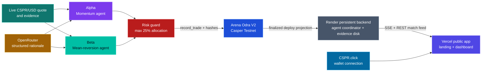
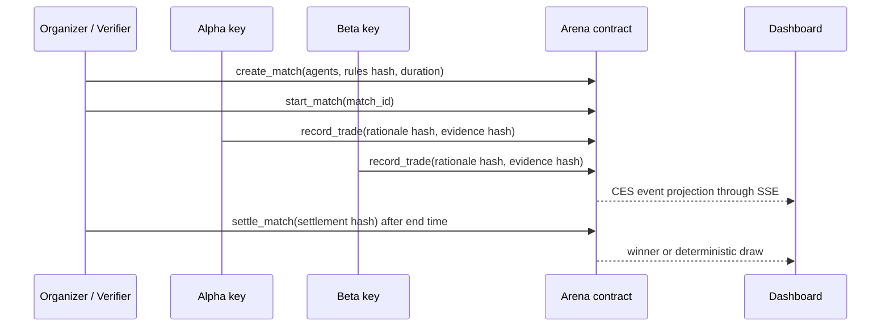

# Arena ⚔️

**A verifiable AI agent treasury league on Casper Testnet.** Alpha and Beta run distinct strategies against the same virtual CSPR treasury benchmark; every permitted decision, its model-rationale hash, evidence hash, and final settlement are recorded on-chain.

[Live application](https://arena-on-casper.vercel.app) | [Live dashboard](https://arena-on-casper.vercel.app/dashboard) | [Final-round demo video](https://youtu.be/Rkg04AOxhhQ) | [Arena V2 contract](https://testnet.cspr.live/contract/fa3af13862e27d3c094d2ffb3a56113fc924e048b445feb64406690652487d41) | [Contract install deploy](https://testnet.cspr.live/deploy/1a34e5229780188d9eedb173c5d71900d0cfff46f4755ac34f180359309db548)

> Arena is a benchmark and audit layer, not a custody product, exchange, prediction market, or gambling application. The portfolios are virtual. Casper Testnet is the authoritative record of agent authorization, decisions, and settlement.

## Why Arena

AI agents increasingly make treasury and market-allocation recommendations, but their decisions are usually opaque and unverifiable. Arena turns that into a public benchmark:

1. Two independently keyed agents receive the same virtual starting treasury.
2. Each decision uses a live market quote, a strategy-specific prompt, an LLM rationale, and a hard allocation guard.
3. The decision and its evidence hashes are committed through an Odra contract on Casper Testnet.
4. A verifier can settle only after the match window; the contract selects the winner from the last recorded portfolio values.

## Architecture



### Match Lifecycle



```text
Alpha momentum agent      Beta mean-reversion agent
        |                         |
        +-- OpenRouter rationale -+
        |                         |
        +-- quote + evidence -----+
                                  v
                       Casper Testnet RPC
                                  |
                                  v
                  Arena Odra V2 contract (WASM)
             auth checks | CES events | settlement
                                  |
                                  v
       Render persistent backend + SSE spectator server
                                  |
                                  v
                     Vercel dashboard + CSPR.click
```

## Casper Integration Map

| Casper component | How Arena uses it | Proof |
|---|---|---|
| Casper Testnet | Every match lifecycle action is a signed, finalized Testnet deploy. | CSPR.live deploy links below |
| Odra 2.x | Rust/WASM contract with caller restrictions, timed settlement, and CES events. | `contracts/arena/src/odra_contract.rs` |
| `casper-js-sdk` 5.0.12 | Loads local Testnet keys, builds stored-contract deploys, signs, submits, retries network errors, and waits for finality. | `agents/shared/arena-client.ts` |
| CSPR.live | Human-verifiable deploy and contract proof surface. | Proof table below |
| CSPR.click | Browser wallet connection through its unified wallet client, configured with a registered production application ID. | `public/wallet.js` |
| Casper accounts | Alpha, Beta, and verifier have separate Testnet identities; the contract checks the actual caller. | `record_trade` and `settle_match` restrictions |

Arena does **not** currently use CSPR.cloud streaming, CSPR.trade MCP, x402, the Casper MCP Server, or a tokenized RWA contract. They must not be selected as implemented technologies in the BUIDL form.

## Final Round Proofs

Active V2 contract: [`contract-fa3af13862e27d3c094d2ffb3a56113fc924e048b445feb64406690652487d41`](https://testnet.cspr.live/contract/fa3af13862e27d3c094d2ffb3a56113fc924e048b445feb64406690652487d41).

| Transaction | Entry point | CSPR.live proof |
|---|---|---|
| Arena V2 contract | Contract explorer | [open](https://testnet.cspr.live/contract/fa3af13862e27d3c094d2ffb3a56113fc924e048b445feb64406690652487d41) |
| Contract installed | Odra WASM install deploy | [open](https://testnet.cspr.live/deploy/1a34e5229780188d9eedb173c5d71900d0cfff46f4755ac34f180359309db548) |
| Match 3 settled (draw) | `settle_match()` | [open](https://testnet.cspr.live/deploy/6f83f9f6655a7c749998d13ffccbe25e8ed07e1187d45f4dcbe1607bc10140c8) |
| Live Match 19 created | `create_match()` | [open](https://testnet.cspr.live/deploy/2dd66bf549d22e1de3dc6b022586ad9c32126dc4fe24d3314762547f59d18dbe) |
| Live Match 19 started | `start_match()` | [open](https://testnet.cspr.live/deploy/206f88d35390c4345542de735488355f4407f45580594cdca1b2cae8628276cb) |
| Live Match 19 Alpha BUY | `record_trade()` | [open](https://testnet.cspr.live/deploy/e2eed1407ca42d731f35297cfaa573e7fe176285e9d65c0d9110adde4489ab49) |
| Live Match 19 Alpha SELL | `record_trade()` | [open](https://testnet.cspr.live/deploy/e03cbdf37e65571159c3ea3fded8250eaac333d9919c76745ec8b1a6bf0477b2) |
| Live Match 19 Beta decision | `record_trade()` | [open](https://testnet.cspr.live/deploy/2b630330d46e10dbf0969256db8c39e9d717e5758ebb9f71063ee9e2112d52cd) |
| Live Match 19 settled: Beta wins | `settle_match()` | [open](https://testnet.cspr.live/deploy/e326f3a2afb9332a05bc3625e9cdd818277afa2814d472640e12e440a594d2dd) |

The dashboard exposes the JSON evidence behind each recent decision at `/api/evidence/<evidence_hash>`. It includes the quote payload, model response, guard result, and pre-trade virtual portfolio. The chain contains only hashes, which keeps the on-chain record compact and tamper-evident.

## Deployment

- **Frontend:** [Vercel](https://arena-on-casper.vercel.app) serves the public landing page and live dashboard.
- **Live agent backend:** [Render](https://arena-live-backend.onrender.com/api/health) runs the persistent spectator service, sequential agent coordinator, SSE event feed, and durable match/evidence projection.
- **Why two services:** Vercel serves the public web experience; Render provides the persistent process and disk required for long-running agent matches and Server-Sent Events.
- **Blockchain:** Casper Testnet records match creation, agent decisions, and verifier settlement through the Arena Odra contract.

## Smart Contract Guarantees

`contracts/arena/src/odra_contract.rs` enforces the following on Casper Testnet:

- `create_match` stores creator, distinct agent public keys, verifier public key, rules hash, market identifier, budget, and end time.
- `start_match` accepts only the creator or registered verifier.
- `record_trade` accepts only one of the registered agent accounts while the match is active.
- `settle_match` accepts only the registered verifier after the stored end time, and derives the winner from on-chain values. It does not accept caller-provided final scores.
- CES events provide the proof surface for match creation, start, each decision, and settlement.

## Quick Start

### Prerequisites

- Node.js 20+
- Rust stable plus `wasm32-unknown-unknown`
- Odra CLI and the wasm tools used by `scripts/odra-build.sh`
- Three funded Casper Testnet PEM keys: Alpha, Beta, and verifier

```bash
git clone https://github.com/nikhilraikwar/arena-casper.git
cd arena-casper
npm install
cp .env.example .env
npm run build
(cd contracts/arena && cargo odra test)
npm run dev:demo
```

Open `http://localhost:3001` in another terminal with:

```bash
npm run dev:spectator
```

## Environment Configuration

Copy `.env.example` to `.env`. Keep `.env`, `keys/`, and `.arena/` out of Git. The values below are safe to name in documentation, but private PEM contents and `OPENROUTER_API_KEY` must never be shared.

| Variable | Set for a live submission? | Purpose |
|---|---:|---|
| `ARENA_MODE=live` | Yes | Enables signed Casper Testnet deploys. Use `mock` only for the local demo. |
| `ARENA_NETWORK=testnet`, `ARENA_CHAIN_NAME=casper-test` | Yes | Network labels used by the client. |
| `ARENA_RPC_URL` or `TESTNET_RPC` | Yes | Casper Testnet RPC endpoint. The default is the public Testnet RPC. |
| `ARENA_CONTRACT_HASH` | Yes | Active Arena V2 contract hash, without a deploy URL. |
| `ARENA_CONTRACT_DEPLOY_HASH` | Yes for the dashboard | Deploy hash for the active contract, used to render the CSPR.live proof link. |
| `ARENA_PACKAGE_HASH` | After deployment | Package hash recorded by the deployment script for future contract administration. |
| `CSPR_LIVE_BASE_URL` | Recommended | Explorer base URL; keep `https://testnet.cspr.live/deploy`. |
| `ARENA_CREATOR_SECRET_KEY`, `ARENA_ALPHA_SECRET_KEY`, `ARENA_BETA_SECRET_KEY`, `ARENA_VERIFIER_SECRET_KEY` | Yes | PEM paths for the creator, Alpha, Beta, and verifier accounts. The `AGENT_*_KEY_PATH` and `VERIFIER_KEY_PATH` variables are supported aliases. |
| `ARENA_CREATOR_ACCOUNT`, `ARENA_ALPHA_ACCOUNT`, `ARENA_BETA_ACCOUNT`, `ARENA_VERIFIER_ACCOUNT` | Yes | Matching public-key hex strings. `npm run live:check` validates each against its PEM. |
| `ARENA_KEY_ALGORITHM=ed25519` | Recommended | Documents the expected Testnet key type. |
| `MATCH_ID` | Yes | Next on-chain match ID before `live:create`; update it after a successful create. |
| `MATCH_DURATION_MS`, `MATCH_START_BUDGET`, `MATCH_POLL_MS` | Yes | Match window, virtual starting portfolio (motes), and polling cadence. |
| `TICK_MS=120000` | Yes | Minimum 2-minute live-agent interval to avoid Testnet finality and nonce collisions. |
| `DEPLOY_TIMEOUT_MS` | Recommended | Per-deploy finality timeout; default is 90 seconds. |
| `PAYMENT_MOTES`, `CONTRACT_DEPLOY_PAYMENT_MOTES` | Yes | Payment amounts for contract calls and the contract install deploy. |
| `AGENT_ITERATIONS` | Optional | Number of decisions run by each agent invocation. |
| `OPENROUTER_API_KEY`, `AI_MODEL` | Yes | LLM rationale provider and model. `openai/gpt-4o-mini` is the low-cost structured-output default; use `openrouter/free` only for no-cost experimentation. |
| `ARENA_PUBLIC_URL` | Yes for a hosted demo | Public origin sent as the OpenRouter referrer and used by the web app. |
| `CSPR_CLICK_APP_ID` | Yes for a hosted demo | Registered production CSPR.click application ID. `csprclick-template` is localhost-only. |
| `SPECTATOR_PORT` | Optional | Express/SSE server port; default `3001`. |

`CSPR_CLOUD_API_KEY`, CSPR.cloud event URLs, x402 credentials, and CSPR.trade credentials are deliberately not included: this version does not implement those integrations.

## Testnet Runbook

1. Put funded Ed25519 PEM files in `keys/` and configure their paths and public keys in `.env`. Never commit PEM files or API keys.
2. Build and deploy the contract:

```bash
bash scripts/setup-testnet.sh
```

3. Set `ARENA_MODE=live`, set `MATCH_ID` to the next on-chain counter for this contract, then run the lifecycle in order:

```bash
npm run live:check
npm run live:create
npm run live:start
npm run live:run
# wait at least TICK_MS (120 seconds), then repeat live:run to add verified history
npm run live:run
# wait until MATCH_DURATION_MS has elapsed
npm run live:settle
```

`TICK_MS` remains `120000` in live mode. Agent deploys are sequential, which avoids finality and nonce collisions on Testnet. Agent state is persisted per contract, match, and agent under `.arena/agent-state/`; five verified quotes are required before the deterministic momentum or mean-reversion rules may open a virtual position.

## Wallet Connection

The public landing page and dashboard load the official CSPR.click client at runtime. A user connects with the `Connect Wallet` control and CSPR.click returns the public account key without exposing a private key. `CSPR_CLICK_APP_ID=csprclick-template` is appropriate for localhost development; register a production application ID before publishing a hosted demo.

## Agent and Risk Design

| Component | Implementation |
|---|---|
| Alpha | Momentum / short-vs-long trend strategy |
| Beta | Mean-reversion after drawdown / recovery |
| Model | OpenRouter structured JSON response; `openai/gpt-4o-mini` is the low-cost default |
| Risk guard | Maximum 25% allocation and minimum 35 confidence |
| Market input | Live CSPR/USD quote with the raw response retained in evidence |
| RWA framing | `CSPR/sCSPR/TREASURY` benchmark identifier only; it is not a tokenized-RWA integration |
| On-chain state | Casper Testnet, Rust, Odra 2.x, CES events |
| UI | Express, SSE, vanilla HTML/CSS/JS, Chart.js, CSPR.click |

## Judging Coverage

| Criterion | Arena evidence |
|---|---|
| Agentic AI | Separate strategy prompts, independent keys, model rationales, and deterministic safety guard |
| DeFi / financial use case | Transparent treasury-allocation benchmark with equal starting portfolios |
| RWA relevance | Treasury-risk benchmark framing, explicitly separated from a future tokenized-RWA integration |
| Casper integration | Odra contract, real Testnet deploys, CES events, CSPR.live proofs, and CSPR.click wallet connection |
| Technical rigor | Caller restrictions, verifier-only timed settlement, atomic evidence/cache writes, retries, and deploy finality checks |
| Demo quality | Live SSE dashboard, evidence links, deploy links, and a complete Testnet lifecycle |

## Verification

```bash
npm run build
cargo test --manifest-path contracts/arena/Cargo.toml
(cd contracts/arena && cargo odra test)
(cd contracts/arena && cargo odra build)
```

## License

MIT

Built for the Casper Agentic Buildathon 2026 Final Round.
